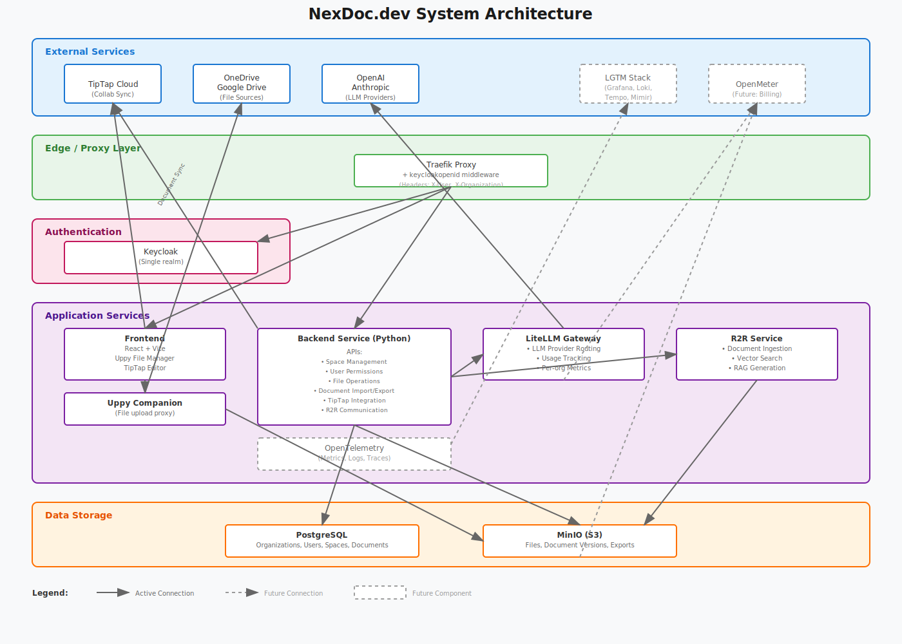

# NexDoc.dev

A multi-tenant collaborative document creation platform that combines human expertise with AI-powered assistance to streamline report generation.

## Overview

NexDoc.dev enables organizations to create professional documents through real-time collaboration between team members and AI agents. The platform provides a seamless workflow from resource gathering to final document export.

### Core Workflow

1. **Import Resources** - Users can import files from multiple sources including OneDrive, Google Drive, and local storage. The platform supports various file types including PDFs, documents, videos, photos, and audio files.

2. **Unified File Explorer** - All imported resources are displayed in a unified file explorer, providing a single interface to manage content regardless of its original source.

3. **Create Collaborative Spaces** - Users select relevant files to create a new "Space" - a collaborative workspace that can be shared with team members within the organization of the user. Each space serves as a container for related resources and documents.

4. **Document Creation** - Within a space, users can create new documents either from scratch or using uploaded blueprints/templates. The document editor provides a familiar interface enhanced with AI capabilities.

5. **AI-Powered Collaboration** - An LLM agent works alongside users in the editor, with full access to all files within the space. The agent performs intelligent RAG (Retrieval-Augmented Generation) to provide contextual assistance, suggest content, and help structure the document.

6. **Change Tracking** - All modifications made by both users and the AI agent are tracked as diffs, allowing users to review, accept, or revert changes. This ensures full control over the document evolution.

7. **Smart Document Editing** - The AI agent can not only suggest text but also modify document layout, insert relevant images from the space resources, and format content appropriately.

8. **Export & Share** - Completed documents can be exported in various formats, ready for distribution or further processing.

### Key Features

- **Unified File Management** - Import from OneDrive, Google Drive, local storage and more (later: real time sync)
- **AI-Powered Assistance** - LLM agents with RAG capabilities for intelligent document creation
- **Real-time Collaboration** - Live multi-user editing with change tracking
- **Visual Document Enhancement** - AI-assisted layout editing and image insertion
- **Template System** - Create documents from organizational blueprints
- **Comprehensive Change Control** - Diff-based tracking for all document modifications
- **Flexible Export Options** - Generate documents in multiple formats

## System Architecture

See the complete system architecture diagram above showing the platform design with external services, edge routing, authentication, application services, and data storage layers.

## Core Components

### Authentication & Routing
- **Traefik** - Reverse proxy with automatic HTTPS and request routing
- **Keycloak** - Enterprise-grade authentication

### Application Layer
- **Frontend** - React-based UI with TipTap collaborative editor and Uppy file management
- **Backend** - Python FastAPI for core application logic, handling document creation, user management, and AI interactions
- **Companion** - Uppy companion server for secure file uploads from cloud providers

### AI & Search
- **LiteLLM** - Unified gateway for LLM providers with usage tracking
- **R2R** - Advanced RAG (hybrid or agentic retrival) platform used for the AI Agent in document creation

### Storage
- **PostgreSQL** - Application data and metadata
- **MinIO** - S3-compatible object storage for documents and files

## Architecture Decisions

- **Collaborative Editing via TipTap Cloud** - Leverages proven infrastructure for real-time synchronization (after all users have left, a backup is saved by the backend to the object storage and can be restored later)
- **Kubernetes-Native Deployment** - Full platform deployed on K3S cluster with auto-scaling and high availability
- **K3D for Local Development** - Local Kubernetes development environment for testing cluster deployments